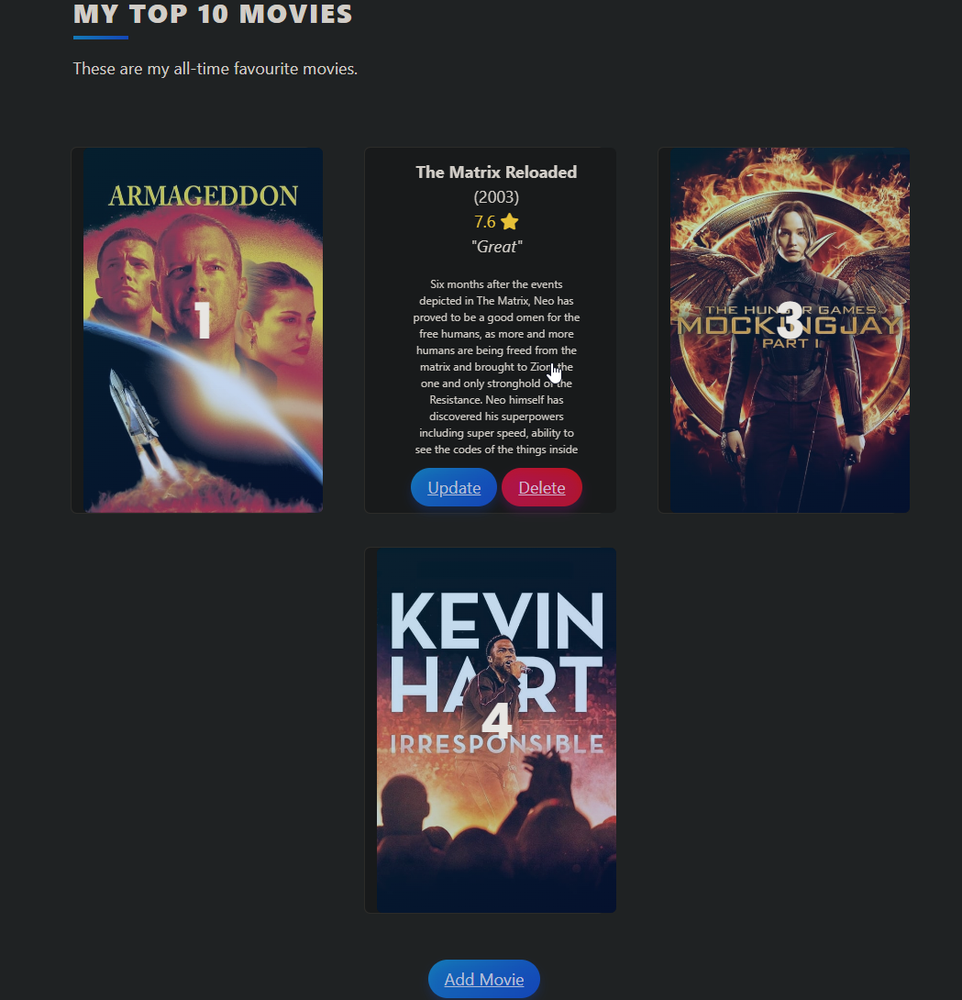

# WebApp for Storing favorite Movies from TMDB API

## How to start
Install requirements from "requirements.txt"
```
$ pip install -r requirements.txt
```
Start Flask Server
```
$ flask --app main run
 * Serving Flask app 'main'
 * Running on http://127.0.0.1:5000 (Press CTRL+C to quit)
 ```

##Explanation
Click on "Add Movie" and enter movie title. Server will get results from "TMDB API".
Select one, and it will be stored in a database. 
You can also rate Movies and with refreshing "index.html" your movies will be sorted.

## Screenshot


## Why I made this
My main goal was to practice the following Python concepts:
- Using libraries like Flask, SQLAlchemy, WTForms
- api
- bootstrap

## License
MIT License

Copyright (c) 2003 utnelson

Permission is hereby granted, free of charge, to any person obtaining a copy
of this software and associated documentation files (the "Software"), to deal
in the Software without restriction, including without limitation the rights
to use, copy, modify, merge, publish, distribute, sublicense, and/or sell
copies of the Software, and to permit persons to whom the Software is
furnished to do so, subject to the following conditions:

The above copyright notice and this permission notice shall be included in all
copies or substantial portions of the Software.

THE SOFTWARE IS PROVIDED "AS IS", WITHOUT WARRANTY OF ANY KIND, EXPRESS OR
IMPLIED, INCLUDING BUT NOT LIMITED TO THE WARRANTIES OF MERCHANTABILITY,
FITNESS FOR A PARTICULAR PURPOSE AND NONINFRINGEMENT. IN NO EVENT SHALL THE
AUTHORS OR COPYRIGHT HOLDERS BE LIABLE FOR ANY CLAIM, DAMAGES OR OTHER
LIABILITY, WHETHER IN AN ACTION OF CONTRACT, TORT OR OTHERWISE, ARISING FROM,
OUT OF OR IN CONNECTION WITH THE SOFTWARE OR THE USE OR OTHER DEALINGS IN THE
SOFTWARE.